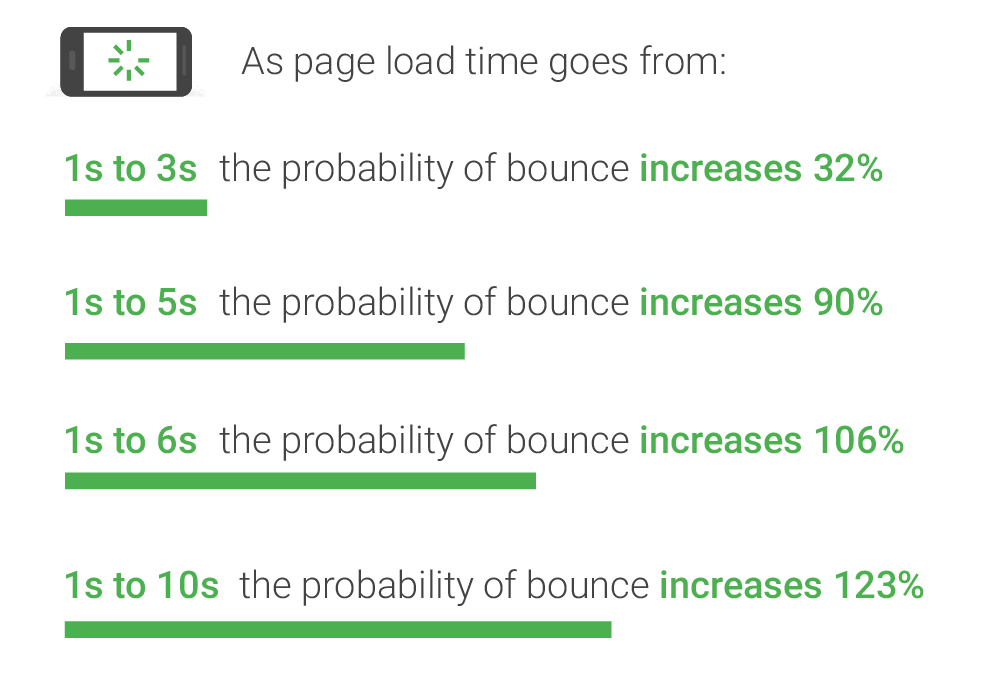

# Introductie

**Web Performance** = Snelheid. 

**Het geeft aan hoe snel je website wordt geladen en hoe snel content aan de gebruiker wordt getoond. Belangrijk hierbij is ook vanaf welk punt de gebruiker met jouw website aan de slag kan.**


**Web Performance is niet gelijk aan SEO. Web Performance is een onderdeel van SEO.**


### Waarom?

* Een gebruiker arriveert op je site
* Het laden start
* Hoe langer het laden duurt hoe meer kans dat de gebruiker je website snel verlaat.
* Als de gebruiker je website snel verlaat denkt Google dat je content niet relevant was

Hoe 'snel' iets laad is wetenschappelijk bepaald:

* 0.1s: Voelt als onmiddelijk
* 1s: Gebruiker merkt de vertraging om maar blijft gefocust
* 10s: Absolute limiet. De gebruiker moet weten wat er zo lang duurd. \(Kan door een loader te plaatsen bvb\)

Niemand houdt toch van wachten? 😱

We optimaliseren dus in de eerste plaats voor **de gebruiker**, daarnaast optimaliseren we ook voor **de server**, hoe minder die moet 'werken' hoe meer verkeer hij zal aankunnen en dat is dan weer beter voor **je portemonee.** Zo hoef je geen dure server te betalen. ****Als laatste optimaliseren we natuurlijk ook voor jezelf. Je wil namelijk zo professioneel mogelijk overkomen. Toch?

In deze space gaan we tips & tricks bekijken om je website zo performant mogelijk te maken, en er dus voor te zorgen dat er zoveel mogelijk gebruikers op je website blijven.


#### De Grow screencast over dit onderwerp vind je hier: [https://grow.nxtmedia.technology/video/101-performance-introductie](https://grow.nxtmedia.technology/video/101-performance-introductie)


