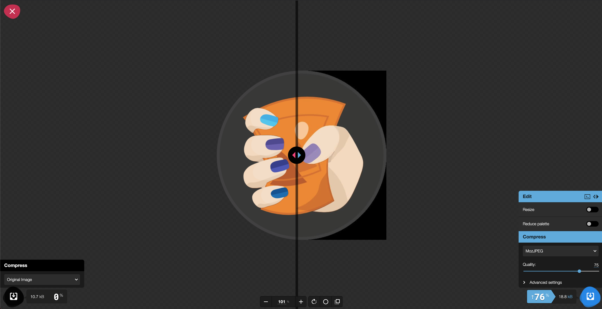

# Images

Afbeeldingen zijn een niet weg te denken aspect van een website. Ze maken je website visueel aantrekkelijker en vormen een belangrijke fundering van het design.

Maar afbeeldingen zijn ook extra content en assets die moeten worden ingeladen als je website laad. Ze hebben dus ook een impact op de performantie en snelheid van je website. Het is dus van belang dat we de afbeeldingen zelf zo goed mogelijk proberen te optimaliseren

### Onnodige data verwijderen

Afbeeldingen bevatten vaak extra data die overbodig wordt van zodra je ze op je website gebruikt. Dit noemen we [exif data](https://en.wikipedia.org/wiki/Exif){:target="_blank"}. Denk aan:

* Type camera
* Camera instellingen \(Witbalans, Shutterspeed, ...\)
* Locatie van de foto
* Datum & tijd
* ...

Deze data is onnodig voor op je website aangezien je deze toch niet zal kunnen tonen aan je gebruiker. We  kunnen deze data dus best van de afbeeldingen verwijderen.

### Correcte grootte

Onder het motto: "Gebruik je gezond verstand".

Zorg er steeds voor dat je afbeeldingen voldoen aan de grootte waarop je ze gaat tonen op je website. Zo heeft het bvb geen zin om een afbeelding die getoond zal worden als achtergrond in een `div` met dimensies 500px op 250px in het formaat 2000px op 1000px op je website in te laden. Dat veroorzaakt een gigantische overhead

Op een webshop bvb zijn de afbeeldingen die getoond worden op het product overzicht van lagere kwaliteit en resolutie dan diegene die je op de product detail pagina te zien krijgt. In het product overzicht worden de afbeeldingen namelijk in zeer kleine blokjes getoond terwijl dit op de product detail pagina dan weer heel groot is. Het heeft geen zin om op onze overzichtspagina diezelfde grote afbeelding in te laden als op de detail pagina.

### Responsive Images

Op deze manier kan je afbeeldingen meegeven met je HTML en je browser zelf laten kiezen welke afbeelding hij gebruikt op basis van de schermgrootte van de gebruiker op dat moment. Je vind er [hier](https://developer.mozilla.org/en-US/docs/Learn/HTML/Multimedia_and_embedding/Responsive_images){:target="_blank"} meer info over.

### Optimalisatie tools

Er bestaan veel tools om afbeeldingen te optimaliseren voor het web. Enkele voorbeelden hiervan zijn:

* ImageOptim
* PNGMini
* PNGauntlet
* Kraken
* ...

Een van de meer bekende tools is [Squoosh](https://squoosh.app/){:target="_blank"}. Een tool die door Google is ontwikkeld en die spectaculaire resultaten opleverd. Ga er zeker eens mee aan de slag!

