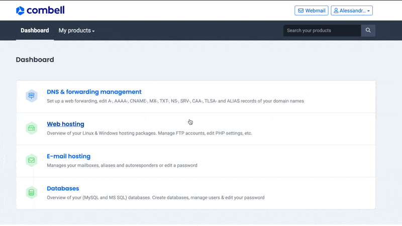
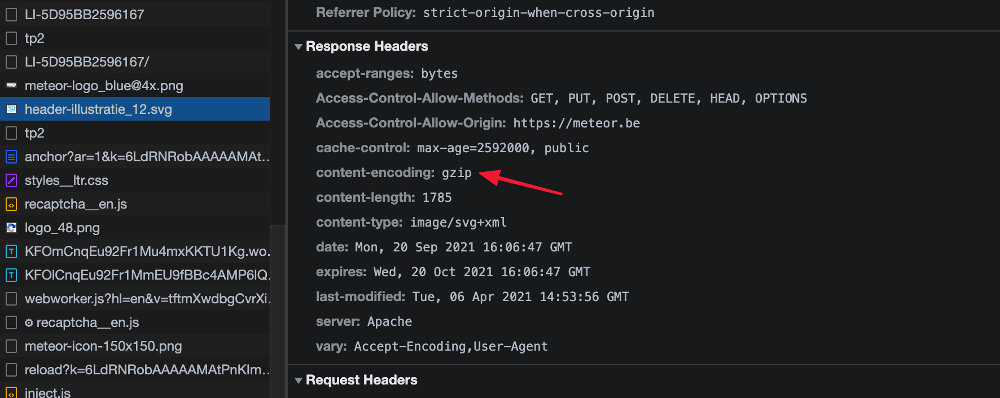

# GZIP Compressie

Ooit al eens een groot bestand proberen te versturen via mail?

Dat duurt lang...heel lang... Wat het process kan versnellen is dit bestand 'compressen' of 'zippen'. Dat maakt de totale grootte van het bestand dat je moet versturen namelijk een pak kleiner.

Dat is exact hoe GZIP compressie ook werkt. Resources worden niet rechtstreeks over het internet verstuurd naar de gebruiker maar worden eerst netjes 'ingepakt' in een soort zip bestandje. Alle moderne browsers kunnen dit bestandje herkennen en kunnen de originele content hiervan 'uitpakken'. Op die manier worden er bit & bytes bespaard bij het inladen wat de snelheid ten goede komt.


Gzip compressie is super makkelijk in te schakelen via jouw hosting paneel van Combell. Het is dus een absolute **must**.


### Wordt er GZIP gebruikt?

Of een site GZIP compressie gebruikt is makkelijk te achterhalen via de Chrome Dev Tools.

Wanneer de de header _Content-Encoding ****_de waarde **gzip** heeft dan wordt er GZIP compressie gebruikt op de site.



