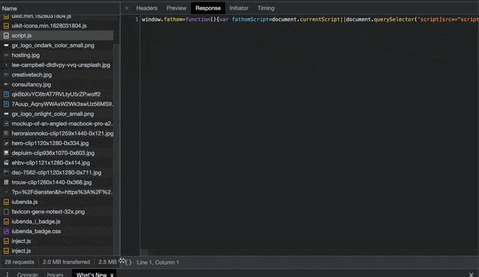

# Minify & Uglify



```text
   let result = x + y;
   
   return result;
} 
```



Minify & Uglify zijn beide optimalisaties die je kan doen op het vlak van code om je website performanter te maken.

### Minify

Bij code die is geminified zijn de onnodige spaties & enters weggehaald. Hieronder zie je een voorbeeldje.



```text
function sumFromTwoNumbers(x,y) {
   let result = x + y;
   
   return result;
} 
```



```text
function sumFromTwoNumbers(x,y) {let result = x + y;return result;} 
```



Goed om te weten is dat we van minified code steeds terug de 'originele' code kunnen achterhalen.



### Uglify

Bij code die is 'geuglified' zijn namen van variabelen en functies, in sommige gevallen ook hele delen code, veranderd of herschreven om de code korter \(en de file dus kleiner qua grootte\) te maken.



```text
function sumFromTwoNumbers(x,y) {
   let result = x + y;
   
   return result;
} 
```



```text
function s(r,u){return r+u}
```




Uglify'en is een destructieve actie, de originele code kan niet meer achterhaald worden. Er is bij uglify'en ook meer kans tot de introductie van bugs...



Later zal je zien dat er automatische processen zijn die er voor zorgen dat de code die jij schrijft automatisch wordt geminified/uglified alvorens ze ergens online komt.






